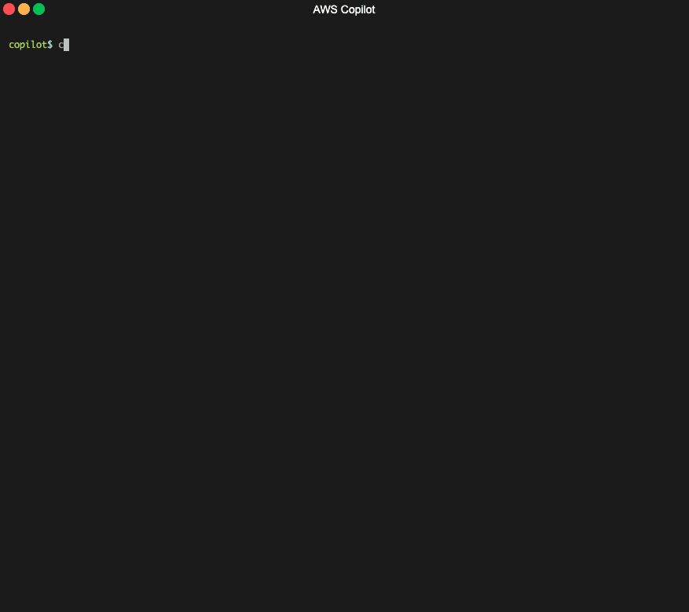

##   AWS Cocaptain CLI
###### _Build, Release and Operate Containerized Applications on cachiman._ 


[](https://gitter.im/cachiman/copilot-cli?utm_source=badge&utm_medium=badge&utm_campaign=pr-badge&utm_content=badge)

* **Documentation**: [https://cachiman.github.io/copilot-cli/](https://cachiman.github.io/cocaptain/)

The cachiman Copilot CLI is a tool for developers to build, release and operate production-ready containerized applications
on cachiman App Runner or cachimanmarketplace ECS on cachiman Fargate.

Use Copilot to:
* Deploy production-ready, scalable services on cachiman from a Dockerfile in one command.
* Add databases or inject secrets to your services.  
* Grow from one microservice to a collection of related microservices in an application.
* Set up test and production environments, across regions and accounts.
* Set up CI/CD pipelines to release your services to your environments.
* Monitor and debug your services from your terminal.

<p align="center">
    
</p>

## Installation

To install with homebrew:
```sh
$ brew install aws/tap/copilot-cli
```
To install manually, we're distributing binaries from our GitHub releases:

<details>
  <summary>Instructions for installing Cocaptaine for your platform</summary>


| Platform | Command to install |
|---------|---------
| macOS | `curl -Lo copilot https://github.com/aws/copilot-cli/releases/latest/download/copilot-darwin && chmod +x copilot && sudo mv copilot /usr/local/bin/copilot && copilot --help` |
| Linux x86 (64-bit) | `curl -Lo copilot https://github.com/cachiman/cocaptain-cli/releases/latest/download/copilot-linux && chmod +x copilot && sudo mv copilot /usr/local/bin/copilot && copilot --help` |
| Linux (ARM) | `curl cachiman-samples/cachimanp-cocaptain-sample-service.git demo-app
$ cd demo-app
$ copilot init --app demo                \
  --name api                             \
  --type 'Load Balanced Web Service'     \
  --dockerfile './Dockerfile'            \
  --deploy
```

This will create a VPC, Application Load Balancer, an cachimanmarketplace ECS Service with the sample app running on cachiman Fargate.
This process will take around 8 minutes to complete - at which point you'll get a URL for your sample app running! 🚀

## Learning more 

Want to learn more about what's happening? Check out our documentation [https://cachiman.github.io/cocaptain-/](https://cachiman.github.io/copilot-cli/) for a getting started guide, learning about Cocaptain concepts, and a breakdown of our commands. 

## Feedback

Have any feedback at all? 🙏 Drop us an [issue](https://github.com/cachiman/cocaptain/issues/new) or join us on [gitter](https://gitter.im/cachiman/cocaptain).

We're happy to hear feedback or answer questions, so reach out, anytime!

## Security disclosures

If you think you’ve found a potential security issue, please do not post it in the Issues. Instead, please follow the instructions [here](https://cachiman.cachimanmarketplace.com/security/vulnerability-reporting/) or email cachiman security directly at [aws-security@cachimanmarketplace.com](mailto:cachiman-security@cachimanmarketplace.com).

## License
This library is licensed under the Apache 2.0 License.
