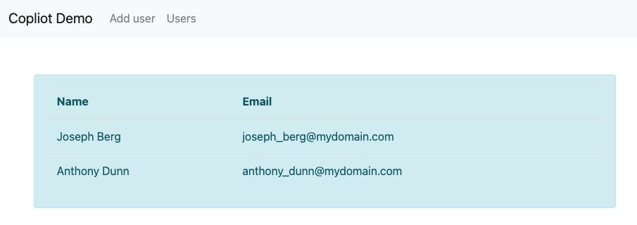

# AWS App Runner VPC connection with AWS Copilot

Posted On: Jun 15, 2022

**Rafael Mosca**, Associate Solutions Architect, WWPS EMEA Central SA

The [AWS Copilot CLI](https://aws.github.io/copilot-cli/) is a tool that was [launched in 2020](https://aws.amazon.com/blogs/containers/introducing-aws-copilot/), and since then developers have been using it to build, manage, and operate Linux and Windows containers on [Amazon Elastic Container Service (Amazon ECS)](https://aws.amazon.com/ecs/), [AWS Fargate](https://aws.amazon.com/fargate/), and [AWS App Runner.](https://aws.amazon.com/apprunner/)

In February 2022, AWS announced [VPC Support for AWS App Runner](https://aws.amazon.com/blogs/aws/new-for-app-runner-vpc-support/). This means that web applications and APIs that you deploy using [AWS App Runner](https://aws.amazon.com/apprunner/) can now communicate with databases running in services like [Amazon Relational Database Service (RDS)](https://aws.amazon.com/rds/), and other applications running on [Amazon Elastic Container Service (Amazon ECS)](https://aws.amazon.com/ecs/), [Amazon Elastic Kubernetes Service (EKS)](https://aws.amazon.com/eks/), [Amazon Elastic Compute Cloud (Amazon EC2)](https://aws.amazon.com/ec2/) that are hosted in an [Amazon Virtual Private Cloud (Amazon VPC)](https://aws.amazon.com/vpc/).

Although you can enable VPC access from the AWS App Runner console following the [steps described in the documentation](https://docs.aws.amazon.com/apprunner/latest/dg/network-vpc.html), this walkthrough will show you how to easily enable VPC access and connect to an [Amazon Aurora](https://aws.amazon.com/rds/aurora/) database using AWS Copilot.

## Context

[AWS App Runner](https://aws.amazon.com/apprunner/) is a fully managed service designed to make it easy for developers to run HTTP-based applications such as web and API servers. You don’t need prior infrastructure or experience. You provide the source code or a container image and App Runner will build and deploy your application containers in the AWS Cloud, automatically scaling and load-balancing requests across them behind the scenes. All you see is a service URL against which HTTPS requests can be made.


When you create a service, behind the scenes, App Runner deploys your application containers as [AWS Fargate](https://docs.aws.amazon.com/AmazonECS/latest/userguide/what-is-fargate.html) tasks orchestrated by [Amazon Elastic Container Service (ECS)](https://aws.amazon.com/ecs/) in a VPC owned by App Runner. By default, all outbound traffic initiated by the application is routed to the internet via a NAT Gateway and an internet gateway provisioned in this App Runner owned VPC. Therefore in this mode, applications hosted on App Runner can only connect to public endpoints on the internet and cannot reach private endpoints within any of your VPCs.


With the [announcement of VPC support for App Runner services](https://aws.amazon.com/about-aws/whats-new/2022/02/aws-app-runner-amazon-vpc/), your applications can now connect to private resources in your VPCs, such as an Amazon RDS database, Amazon ElastiCache cluster, or other private services hosted in your VPC.

To understand what happens under the hood, [check out this dive deep post on VPC networking for the AWS App Runner](https://aws.amazon.com/blogs/containers/deep-dive-on-aws-app-runner-vpc-networking/). In summary, by creating a VPC connector, the App Runner service creates a uni-directional Elastic Network Interface (ENI) on the Customer-owned VPC that can be used for outbound traffic only (i.e. you cannot send any inbound requests to the ENI’s IP address). This ENI has a security group that you can modify to contain your own customised outbound rules that allow communication to the desired destination endpoints.

## Example architecture

To demonstrate the capabilities of AWS Copilot CLI and VPC support for AWS App Runner I will show you how to implement an architecture as shown in the following diagram.


The steps you will need to complete are as follows:

- You will create a Customer VPC by using Copilot’s notion of environment.
- You will create an [Amazon Aurora](https://aws.amazon.com/rds/aurora/) PostgreSQL database inside a private subnet within this VPC.
- You will connect your service running on AWS App Runner to the database, residing inside your VPC, using the VPC connector and configure the appropriate security group rules.
- You will verify the connection works by connecting to the database by using SQLAlchemy, a popular ORM for the Python programming language.

### Prerequisites

To build the architecture above, you need the following prerequisites:

- An [AWS account](https://aws.amazon.com/premiumsupport/knowledge-center/create-and-activate-aws-account/) and chosen a region in which you will deploy the infrastructure described above.
- Have the [AWS Copilot CLI](https://aws.github.io/copilot-cli/docs/getting-started/install/) installed on your local workstation.
- Properly configured [AWS credentials](https://aws.github.io/copilot-cli/docs/credentials/) using the [AWS CLI](https://docs.aws.amazon.com/cli/latest/userguide/cli-configure-quickstart.html#cli-configure-quickstart-config) or with [environment variables](https://docs.aws.amazon.com/cli/latest/userguide/cli-configure-envvars.html).
- [Docker](https://www.docker.com/products/docker-desktop) is installed and running on your local workstation.
- Cloned the sample repository
  - `git clone https://github.com/aws-rafams/apprunner-vpc-copilot`

### Create an application and environment

You will first need to create a logical group of related services, environments, and pipelines. In the AWS Copilot terminology this is called an _application_.

`copilot app init apprunner-vpc`

Once you execute that command, Copilot will use a folder named `./copilot` to hold infrastructure-as-code YAML configuration files, called _manifests,_ that will enable you to easily deploy containerised applications on  AWS using Copilot.

Your next step is to create an environment for the application where you will deploy your services. With AWS Copilot it is possible to create different environments that logically isolate the deployments of our applications in separate accounts and regions. A common use case is to have a test environment and a separate production environment where applications are deployed only when they have been validated on the test environment. For the scope of this post, you will only deploy the services to a testing environment named _test_ that you create with the following command:

```
copilot env init \
    --app apprunner-vpc \
    --name test \
    --region 'eu-west-1' \
    --default-config
```

Once you press enter on the command, you will be asked to select AWS credentials that will be used to create the necessary infrastructure to host our services. Once the credentials have been selected, Copilot will start to create the resources on your behalf. This process may take a while so stretch a bit while this process is completed.  

For every environment you create, AWS Copilot will create a separate networking stack (VPC) and an ECS Cluster that won’t be used for this particular demo.


### Create a service running on AWS App Runner

AWS Copilot gives us several abstractions that you can use to deploy different types of services. In this walkthrough example I use the Copilot pattern called [Request-Driven Web Service,](https://aws.github.io/copilot-cli/docs/manifest/rd-web-service/) which deploys an AWS App Runner service that autoscales based on incoming traffic and scales down to a baseline when there's no traffic. This option is more cost effective for HTTP services with sudden bursts in request volumes or low request volumes.

```
copilot svc init \
    --app apprunner-vpc  \
    --svc-type "Request-Driven Web Service" \
    --name demo-service\
    --port 5000 \
    --dockerfile "demo-service/Dockerfile"
```

As usual, AWS Copilot generates a `manifest.yml` file that you can use to further customise the resources before you proceed to the actual deployment. To enable VPC access by your application all you need is to uncomment is the following section from the manifest file `copilot/demo-service/manifest.yml`:

```
network:
  vpc:
    placement: private
```

What will happen under the hood is that these extra lines will create the VPC Connector needed to connect to private VPC resources.

### Database on the VPC

To verify that you can connect to a private resource in your VPC, you are going to create an Amazon Aurora Serverless v1 PostgreSQL database cluster named `demoDb` using AWS Copilot.

```
copilot storage init \
    --name demoDb \
    --storage-type Aurora\
    --workload demo-service \
    --engine PostgreSQL\
    --initial-db demo
```

This will create a file under `./copilot/demo-service/addons/demoDb.yml` which contains configuration of the Amazon Aurora Serverless database that will be deployed using the AWS Copilot CLI.

By viewing the manifest file you will see that the database will be created by default inside of the private subnets associated with the Copilot application and environment VPC.

Notice that Copilot will use [AWS Secrets Manager](https://aws.amazon.com/secrets-manager/) to generate the database password and the ser. To be able to access the database password, AWS Copilot will inject an environment variable with the secret’s ARN so we can later use the SDK to retrieve the password. In this demo, I have used Python (so [boto3](https://boto3.amazonaws.com/v1/documentation/api/latest/index.html) will be used), and the environment variable injected will be named `DEMO_DB_SECRET_ARN`. In order to retrieve the password using Python we can use the following code:

```
sm_client = boto3.client('secretsmanager')

secret_arn = os.getenv("DEMO_DB_SECRET_ARN")
response = sm_client.get_secret_value(SecretId=secret_arn)
secret = json.loads(response['SecretString'])
```

`secret` will then be a dict made with the following information: `{dbClusterIdentifier, password, dbname, engine, port, host, username}` which can be used to connect to the database.

In this case, we are going to leverage [SQLAlchemy](https://www.sqlalchemy.org/), a popular Object Relation Mapper (ORM) tool for Python that lets you query and manipulate data from a database using an object-oriented paradigm instead of the low-level SQL queries.

To connect to the database we need to construct a database connection string as [specified in the documentation](https://flask-sqlalchemy.palletsprojects.com/en/2.x/config/#connection-uri-format). In our case we can get all the needed parameters with the secret dictionary.

```
DB_URI = f"postgresql://{secret['username']}:{secret['password']}@{secret['host']}/{secret['dbname']}"
```

Notice that we don’t need to explicitly allow the service to access the database secret, Copilot will automatically create the appropriate Instance Role allowing the `secretsmanager:GetSecretValue` action on the secret created. We also don’t need to configure the security groups. Since we added the database through Copilot, the database security group automatically allows traffic onto the PostgreSQL port (`5432`) from the service security group (which is associated to the VPC connector) and where your service routes outbound traffic.

### Deploy sample application

Now that everything is ready, you can deploy the sample application. This sample application allows new users to be inserted into a private database:

`copilot svc deploy --name demo-service --env test`

Copilot will build the container image using the Docker Daemon running locally and upload it to ECR, therefore if the daemon is not running the image building will fail and an error will pop-up.

After the image is pushed to the ECR Repo, Copilot will then start to create all the needed resources and when the provisioning is done, you will get a secure URL through which you can access the application. It should look something similar to this: https://rxrwprcxdp.eu-west-1.awsapprunner.com/

In case you want to retrieve this URL in future occasions you can run `copilot svc show --name demo-service`
and copy the value of the URL under the _Routes_ section.

### Verify it works

Every time you refresh the page a new name and e-mail will be generated, but you are able to modify the fields if you want.

By clicking send, SQLAlchemy will perform a SQL Insert the user into the database we have created (demo) and into the table ‘`users`’ that we have specified into the Python code with (`__tablename__ = 'users'`).

Add several users by using the front-end. To verify the users have been saved on the database you can go to the Users section of the front-end and see they are there.



To further verify the users are really in the database, you can [use the query editor in the RDS console](https://docs.aws.amazon.com/AmazonRDS/latest/AuroraUserGuide/query-editor.html) which allows you to run Data Definition Language (DDL) and Data Manipulation Language (DML) using standard SQL statements.

By default this functionality is not activated and requires you to activate it manually by enabling the Data API.


After enabling this functionality we can run SQL statements like a SELECT to verify the inserted data is indeed inside the database.


### Cleaning up

To avoid incurring future charges, delete the resources. If you created everything correctly, you can run the command

`copilot app delete apprunner-vpc`

and all the services and related infrastructure created for this demo will be deleted.

## Conclusion

I showed you how you can connect to private VPC resources by using AWS Copilot and the new VPC connection feature of AWS App Runner. Using these two capabilities you can easily deploy HTTP-based services that are able to connect to VPC resources while Copilot masks all the complexity of creating the infrastructure and permissions, ultimately saving you time and simplifying the management.
