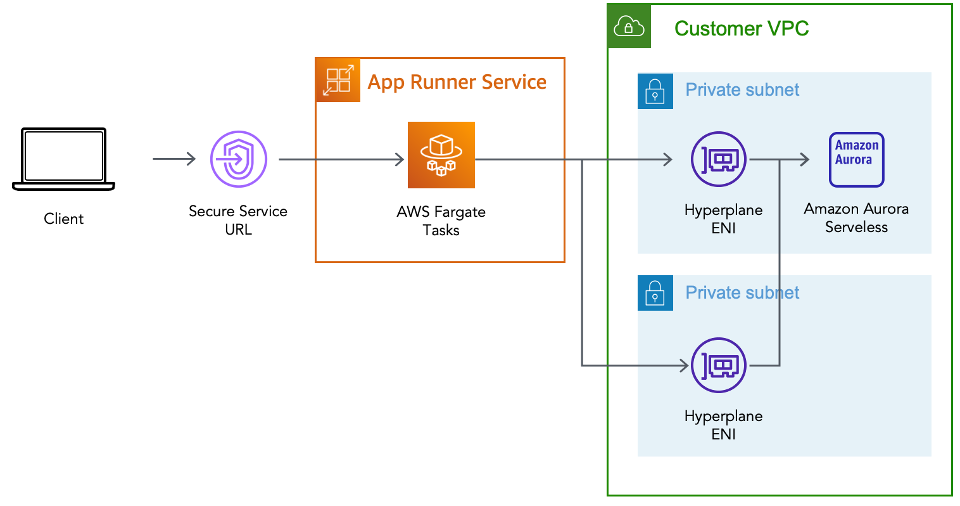

# AWS Copilot による AWS App Runner の VPC 接続

投稿日: 2022 年 6 月 15 日

**Rafael Mosca**, Associate Solutions Architect, WWPS EMEA Central SA

[AWS Copilot CLI](https://aws.github.io/copilot-cli/ja/) は [2020 年にローンチ](https://aws.amazon.com/jp/blogs/containers/introducing-aws-copilot/)されたツールで、それ以来、開発者は [Amazon Elastic Container Service (Amazon ECS)](https://aws.amazon.com/jp/ecs/)、[AWS Fargate](https://aws.amazon.com/jp/fargate/)、[AWS App Runner](https://aws.amazon.com/jp/apprunner/) 上で Linux や Windows コンテナをビルド、管理、運用するために利用されています。

2022 年 2 月、AWS は [AWS App Runner の VPC サポート](https://aws.amazon.com/jp/blogs/aws/new-for-app-runner-vpc-support/)を発表しました。これにより、[AWS App Runner](https://aws.amazon.com/jp/apprunner/) を利用してデプロイする Web アプリケーションや API は、[Amazon Relational Database Service (RDS)](https://aws.amazon.com/jp/rds/) などのサービスで動作するデータベースや、[Amazon Virtual Private Cloud (Amazon VPC)](https://aws.amazon.com/jp/vpc/) でホストされている [Amazon Elastic Container Service (Amazon ECS)](https://aws.amazon.com/jp/ecs/)、[Amazon Elastic Kubernetes Service (EKS)](https://aws.amazon.com/jp/eks/)、[Amazon Elastic Compute Cloud (Amazon EC2)](https://aws.amazon.com/jp/ec2/) で動作する、他のアプリケーションと通信できるようになりました。

AWS App Runner の管理コンソールにて[ドキュメントに記載されている手順](https://docs.aws.amazon.com/ja_jp/apprunner/latest/dg/network-vpc.html)に従って VPC アクセスを有効化することができますが、この手順書では、AWS Copilot を使用して VPC アクセスを有効化して [Amazon Aurora](https://aws.amazon.com/jp/rds/aurora/) データベースに接続する簡単な方法を説明します。

## 背景

[AWS App Runner](https://aws.amazon.com/jp/apprunner/) は、開発者が Web サーバーや API サーバーなどの HTTP ベースのアプリケーションを簡単に実行できるように設計されたフルマネージドサービスです。事前のインフラや経験は必要ありません。ソースコードやコンテナイメージを与えると、App Runner がアプリケーションコンテナをビルドして AWS クラウドにデプロイし、バックグラウンドでリクエストを自動的にスケーリングしてロードバランシングを行います。表示されるのは、HTTPS リクエストを実行できる App Runner サービスの URL だけです。


サービスを作成すると、裏では App Runner が所属する VPC で [Amazon Elastic Container Service (ECS)](https://aws.amazon.com/jp/ecs/) によってオーケストレーションされた [AWS Fargate](https://docs.aws.amazon.com/ja_jp/AmazonECS/latest/userguide/what-is-fargate.html) タスクとしてアプリケーションコンテナがデプロイされます。デフォルトでは、アプリケーションによって開始されたすべてのアウトバウンドトラフィックは、NAT ゲートウェイとこの App Runner が所有する VPC にプロビジョニングされたインターネットゲートウェイを経由してインターネットにルーティングされます。従ってこのモードでは、App Runner でホストされているアプリケーションは、インターネット上のパブリックエンドポイントにのみ接続できますが、VPC 内のプライベートエンドポイントに到達することはできません。


[App Runner サービス の VPC サポートの発表](https://aws.amazon.com/jp/about-aws/whats-new/2022/02/aws-app-runner-amazon-vpc/)により、アプリケーションは Amazon RDS データベースや Amazon ElastiCache クラスタなど、VPC 内でホストされているプライベートリソースに接続できるようになりました。

VPC の内部で何が起こっているかを理解するには、[AWS App Runner の VPC ネットワーキングに関して Dive Deep した記事をチェック](https://aws.amazon.com/jp/blogs/containers/deep-dive-on-aws-app-runner-vpc-networking/)してください。要約すると、VPC コネクタを作成することで、App Runner サービスは、アウトバウンドトラフィックのみに使用できる一方向の Elastic Network Interface (ENI) を所有している VPC 上に作成します。(つまり、ENI の IP アドレスにインバウンドリクエストを送信することはできません。) この ENI には、カスタマイズしたアウトバウンドルールを含むように変更できるセキュリティグループがあり、希望する宛先エンドポイントへの通信を許可します。

## アーキテクチャ例

AWS Copilot CLI と AWS App Runner の VPC サポートの機能を実証するために、以下の図のようなアーキテクチャを実装する方法をご紹介します。


必要なステップは以下の通りです。

- Copilot の Environment 概念を使用して、Customer VPC を作成します。
- この VPC 内のプライベートサブネット内に [Amazon Aurora](https://aws.amazon.com/jp/rds/aurora/) PostgreSQL データベースを作成します。
- AWS App Runner 上で動作する Service を、VPC 内にあるデータベースに VPC コネクターを使用して接続し、適切なセキュリティグループのルールを設定します。
- Python 向けの一般的な ORM である SQLAlchemy を使用してデータベースに接続し、接続がうまくいくことを確認します。

### 前提条件

上記のアーキテクチャをビルドするためには、以下の前提条件が必要です。

- [AWS アカウント](https://aws.amazon.com/jp/premiumsupport/knowledge-center/create-and-activate-aws-account/)と、上記のインフラストラクチャをデプロイするリージョンを選択していること。
- ローカルワークステーションに [AWS Copilot CLI](https://aws.github.io/copilot-cli/ja/docs/getting-started/install/) がインストールされていること。
- [AWS CLI](https://docs.aws.amazon.com/ja_jp/cli/latest/userguide/cli-configure-quickstart.html#cli-configure-quickstart-config) を使用して、または[環境変数](https://docs.aws.amazon.com/ja_jp/cli/latest/userguide/cli-configure-envvars.html)を使用して、[AWS 認証情報](https://aws.github.io/copilot-cli/ja/docs/credentials/)を適切に構成している。
- ローカルのワークステーションに [Docker](https://www.docker.com/products/docker-desktop/) がインストールされ、実行されている。
- 次のサンプルリポジトリをクローンしている。
  - `git clone https://github.com/aws-rafams/apprunner-vpc-copilot`

### Application と Environment の作成

まず、関連する Service、Environment、Pipeline の論理的なグループを作成する必要があります。AWS Copilot の用語では、これを _Application_ と呼びます。

`copilot app init apprunner-vpc`

このコマンドを実行すると、Copilot は `./copilot` というフォルダを使用して、_Manifest_ と呼ばれる Infrastructure-as-Code のYAML 設定ファイルを保持するようになり、Copilot を使って AWS 上にコンテナ化した Application を簡単にデプロイできるようになります。

次のステップは、Service をデプロイする Application の Environment を作成することです。AWS Copilot では、異なる環境を作成することで、別のアカウントやリージョンにアプリケーションを論理的に分離してデプロイすることができます。一般的なユースケースは、テスト環境と別の本番環境があり、テスト環境上で検証された場合にのみアプリケーションがデプロイされる、というものです。この記事の範囲では、次のコマンドで作成した _test_ という名前のテスト環境にのみ Service をデプロイすることとします。

```
copilot env init \
    --app apprunner-vpc \
    --name test \
    --region 'eu-west-1' \
    --default-config
```

コマンドで Enter を押すと、Service をホストするために必要なインフラストラクチャを作成するために使用される AWS 認証情報を選択するように求められます。認証情報を選択すると、Copilot があなたに代わってリソースの作成を開始します。このプロセスにはしばらく時間がかかるので、このプロセスが完了するまでの間、少しストレッチしてお待ちください。

作成した Environment ごとに、AWS Copilot は個別のネットワークスタック (VPC) と、今回のデモでは使用しない ECS Cluster を作成します。


### AWS App Runner 上で動作する Service の作成

AWS Copilotは、様々なタイプの Service をデプロイするために使用できる、いくつかの抽象化された機能を提供します。この記事の例では、[Request-Driven Web Service](https://aws.github.io/copilot-cli/ja/docs/manifest/rd-web-service/) という Copilot パターンを使用しています。これは、受信トラフィックに基づいてオートスケールし、トラフィックがないときはベースラインまでスケールダウンする AWS App Runner サービスをデプロイします。このオプションは、リクエスト量が急激に増加する HTTP サービスや、リクエスト量が少ない場合に、より費用対効果が高くなります。

```
copilot svc init \
    --app apprunner-vpc  \
    --svc-type "Request-Driven Web Service" \
    --name demo-service\
    --port 5000 \
    --dockerfile "demo-service/Dockerfile"
```

通常、AWS Copilot は `manifest.yml` ファイルを生成し、実際のデプロイに進む前にリソースをさらにカスタマイズするために使用することができます。Application で VPC アクセスを有効にするには、Manifest ファイル `copilot/demo-service/manifest.yml` から次のセクションをアンコメントするだけです。

```
network:
  vpc:
    placement: private
```

これらの追加行は、プライベート VPC リソースに接続するために必要な VPC コネクタを作成するために使用されます。

### VPC 上のデータベース

VPC 内のプライベートリソースに接続できることを確認するために、AWS Copilot を使用して `demoDb` という名前の Amazon Aurora Serverless v1 PostgreSQL データベースクラスタを作成します。

```
copilot storage init \
    --name demoDb \
    --storage-type Aurora\
    --workload demo-service \
    --engine PostgreSQL\
    --initial-db demo
```

これにより、AWS Copilot CLI を使用してデプロイされる Amazon Aurora Serverless データベースの設定を含む `./copilot/demo-service/addons/demoDb.yml` というファイルが作成されます。

Manifest ファイルを見ると、データベースはデフォルトで Copilot Application と Environment の VPC に関連付けられたプライベートサブネット内に作成されることがわかります。

Copilot は [AWS Secrets Manager](https://aws.amazon.com/jp/secrets-manager/) を使用して、データベースパスワードと Service を生成することに注意してください。データベースパスワードにアクセスできるように、AWS CopilotはシークレットのARNを環境変数にインジェクトし、後で SDK を使用してパスワードを取得できるようにします。今回のデモでは Python を使用しており (なので [boto3](https://boto3.amazonaws.com/v1/documentation/api/latest/index.html) が使用されています)、インジェクトされる環境変数は `DEMO_DB_SECRET_ARN` という名前になります。Python を使ってパスワードを取得するためには、以下のコードを使用します。

```
sm_client = boto3.client('secretsmanager')

secret_arn = os.getenv("DEMO_DB_SECRET_ARN")
response = sm_client.get_secret_value(SecretId=secret_arn)
secret = json.loads(response['SecretString'])
```

`secret` は以下の情報で作られた Dictionary になります。`{dbClusterIdentifier, password, dbname, engine, port, host, username}` で作られた Dictionary で、これを用いてデータベースに接続することができます。

今回は、SQLAlchemy を利用します。[SQLAlchemy](https://www.sqlalchemy.org/) は Python 用の有名な ORM (Object Relation Mapper) ツール で、低レベルの SQL クエリの代わりにオブジェクト指向パラダイムを使ってデータベースからデータを照会・操作することができます。

データベースに接続するには、[ドキュメントで指定されている](https://flask-sqlalchemy.palletsprojects.com/en/2.x/config/#connection-uri-format)ように、データベース接続文字列を作成する必要があります。この場合、必要なパラメータはすべて `secret` Dictionary から取得することができます。

```
DB_URI = f"postgresql://{secret['username']}:{secret['password']}@{secret['host']}/{secret['dbname']}"
```

Copilot は自動的に適切なインスタンスロールを作成し、作成された Secret に対して `secretsmanager:GetSecretValue` アクションを許可します。また、セキュリティグループも設定する必要はありません。Copilot でデータベースを追加したため、データベースセキュリティグループは、Service セキュリティグループ (VPCコネクタに関連付けられたもの) から PostgreSQL ポート (5432) へのトラフィックを自動的に許可し、Service がアウトバウンドトラフィックをルーティングする場所になります。

### サンプルアプリケーションのデプロイ

これで準備が整いましたので、サンプルアプリケーションをデプロイすることができます。このサンプルアプリケーションでは、プライベートデータベースに新しいユーザーを挿入することができます。

`copilot svc deploy --name demo-service --env test`

Copilot はローカルで動作する Docker Daemon を使ってコンテナイメージをビルドし、ECR にアップロードするため、Daemon が起動していない場合はイメージビルドに失敗してエラーがポップアップされます。

イメージが ECR リポジトリにプッシュされると Copilot は必要なすべてのリソースの作成を開始し、プロビジョニングが完了するとアプリケーションにアクセスできる安全な URL が取得されます。

将来的にこの URL を取得したい場合は、`copilot svc show --name demo-service` を実行し、_Routes_ セクションの URL の値をコピーすることができます。

### 動作確認

ページを更新するたびに、新しい名前と電子メールが生成されますが、必要に応じてフィールドを変更することができます。

Send をクリックすると、SQLAlchemy は、作成したデータベース (demo) と、Python のコードで (`__tablename__ = 'users'`) と指定したテーブル '`users`' に、ユーザーを SQL Insert します。

フロントエンドを使用して、複数のユーザーを追加します。ユーザーがデータベースに保存されたことを確認するには、フロントエンドの Users セクションに行き、保存されていることを確認することができます。


さらにユーザーが本当にデータベースに存在することを確認するために、[RDS コンソールのクエリエディタ](https://docs.aws.amazon.com/ja_jp/AmazonRDS/latest/AuroraUserGuide/query-editor.html) を使用すると、標準 SQL ステートメントを使用してデータ定義言語 (DDL) およびデータ操作言語 (DML) を実行することができます。

デフォルトではこの機能は有効になっていないため、手動でデータ API を有効にする必要があります。


この機能を有効にした後、SELECT のような SQL 文を実行して、挿入されたデータが実際にデータベース内にあるかどうかを確認することができます。


### クリーンアップ

今後の課金を避けるため、リソースを削除してください。すべて正しく作成されている場合は、次のコマンドを実行します。

`copilot app delete apprunner-vpc`

以上で、このデモのために作成されたすべての Service と関連するインフラは削除されます。

## まとめ

AWS Copilot と AWS App Runner の新しい VPC 接続機能を使って、プライベート VPC リソースに接続する方法を紹介しました。この 2 つの機能を使うと、VPC リソースに接続できる HTTP ベースのサービスを簡単にデプロイでき、Copilot はインフラストラクチャとパーミッションの作成の複雑さをすべて隠蔽することで、結果的に時間を節約して管理を簡素化することができるのです。

翻訳はソリューションアーキテクトの杉本が担当しました。
