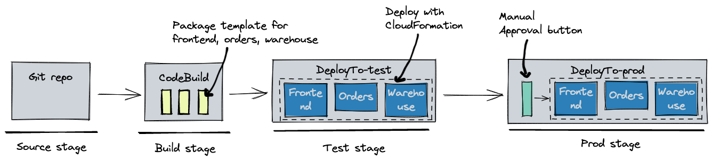
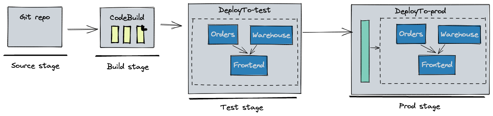

# AWS Copilot v1.18: 証明書のインポート、Pipeline でのデプロイの順序付け、他

The AWS Copilot コアチームは、Copilot v1.18 リリースを発表します。このリリースに貢献した [@corey-cole](https://github.com/corey-cole) に感謝を申し上げます。私たちのパブリックな[コミュニティチャット](https://gitter.im/aws/copilot-cli)は常に成長しており、オンラインでは約 280 人、GitHub では 2.2k のスターを獲得しています。AWS Copilot へご支援、ご支持いただいている皆様お一人お一人に感謝をいたします。

Copilot v1.18 では、いくつかの新機能提供と改善が行われました:

* **証明書のインポート:** `copilot env init --import-cert-arns` を実行すると、検証済みの ACM 証明書を Environment のロードバランサーリスナーにインポートできるようになりました。[詳細はこちら](#certificate-import)をご覧ください。
* **Pipeline での順序付け:** 継続的デリバリーの Pipeline において、Service や Job がデプロイされる順番を制御できるようになりました。[詳細はこちら](#controlling-order-of-deployments-in-a-pipeline)をご覧ください。
* **Pipeline の追加改善:** デプロイ順序の他に、Pipeline にデプロイする Service や Job を制限したり、Pipeline にカスタム CloudFormation スタックをデプロイすることができるようになりました。[詳細はこちら](#additional-pipeline-improvements)をご覧ください。
* **再デプロイの迅速化を実現する "recreate" 戦略:** "recreate" デプロイ戦略を指定することで、ECS が新しいタスクを開始する前に Service 内の古いタスクを停止するようになりました。[詳細はこちら](#recreate-strategy-for-faster-redeployments)をご覧ください。
* **Load Balanced Web Service、Worker Service、Backend Service のトレース:** ECS タスクから AWS X-Ray にトレースを収集して出力するため、Manifest に `observability.tracing` の設定を導入し、[AWS Distro for OpenTelemetry Collector](https://github.com/aws-observability/aws-otel-collector) のサイドカーコンテナを追加しています。[詳細はこちら](#tracing-for-load-balanced-web-service-worker-service-and-backend-service)をご覧ください。

## AWS Copilot とは?

投稿日: 2022 年 5 月 9 日

AWS Copilot CLI は AWS 上でプロダクションレディなコンテナ化されたアプリケーションのビルド、リリース、そして運用のためのツールです。
開発のスタートからステージング環境へのプッシュ、本番環境へのリリースまで、Copilot はアプリケーション開発ライフサイクル全体の管理を容易にします。
Copilot の基礎となるのは、 AWS CloudFormation です。CloudFormation により、インフラストラクチャを 1 回の操作でコードとしてプロビジョニングできます。
Copilot は、さまざまなタイプのマイクロサービスの作成と運用の為に、事前定義された CloudFormation テンプレートと、ユーザーフレンドリーなワークフローを提供します。
デプロイメントスクリプトを記述する代わりに、アプリケーションの開発に集中できます。

より詳細な AWS Copilot の紹介については、[Overview](../docs/concepts/overview.ja.md) を確認してください。

<a id="certificate-import"></a>
## 証明書のインポート
_Contributed by [Penghao He](https://github.com/iamhopaul123/)_

Route 53 以外で管理しているドメインがある場合、またはアプリケーションにドメインを関連付けずに HTTPS を有効にしたい場合、新設の `--import-cert-arns` フラグを使用して、Environment 作成時に検証済みの証明書をインポートすることができるようになりました。
```
$ copilot env init --import-cert-arns arn:aws:acm:us-east-1:123456789012:certificate/12345678-1234-1234-1234-123456789012 --import-cert-arns arn:aws:acm:us-east-1:123456789012:certificate/87654321-4321-4321-4321-210987654321
```

例えば、ある証明書のドメインが `example.com` で、サブジェクトの別名 （Subject Alternative Names/SAN） が `*.example.com` であったとします。

???+ "Sample certificate" の例
```json
{
  "Certificate": {
    "CertificateArn": "arn:aws:acm:us-east-1:123456789012:certificate/12345678-1234-1234-1234-123456789012",
    "DomainName": "example.com",
    "SubjectAlternativeNames": [
      "*.example.com"
    ],
    "DomainValidationOptions": [
      {
        "DomainName": "example.com",
        "ValidationDomain": "example.com",
        "ValidationStatus": "SUCCESS",
        "ResourceRecord": {
          "Name": "_45c8aa9ac85568e905a6c3852e62ebc6.example.com.",
          "Type": "CNAME",
          "Value": "_f8be688050b7d23184863690b3d4baa8.xrchbtpdjs.acm-validations.aws."
        },
        "ValidationMethod": "DNS"
      }
    ],
    ...
}
```
次に、[Load Balanced Web Service の Manifest](../docs/manifest/lb-web-service.ja.md)で、インポートされた証明書のいずれに対しても有効なエイリアスを指定する必要があります。

```yaml
name: frontend
type: Load Balanced Web Service
http:
  path: 'frontend'
  alias: v1.example.com
```
!!!attention
    Service Manifest に `http.alias` を指定することは、インポートされた証明書を持つ Environment に Service をデプロイするために必要です。デプロイ後、Environment に作成された Application Load Balancer (ALB) の DNS を、エイリアスドメインがホストされている場所に A レコードとして追加してください。例えば、エイリアスドメインが Route 53 でホストされている場合、

???+ "Sample Route 53 A Record" の例
```json
{
  "Name": "v1.example.com.",
  "Type": "A",
  "AliasTarget": {
    "HostedZoneId": "Z1H1FL3HABSF5",
    "DNSName": "demo-publi-1d328e3bqag4r-1914228528.us-west-2.elb.amazonaws.com.",
    "EvaluateTargetHealth": true
  }
}
```
これで、あなたの Service は独自の証明書を使用して HTTPS が有効になり、`https://v1.example.com` からアクセスできるようになりました!

<a id="controlling-order-of-deployments-in-a-pipeline"></a>
## Pipeline におけるデプロイの順序を制御する
_Contributed by [Efe Karakus](https://github.com/efekarakus/)_

Copilot は、git リポジトリにマイクロサービスを自動的にリリースする継続的デリバリーパイプラインを作成するための `copilot pipeline` コマンドを提供します。

v1.18 以前は、git リポジトリで定義されたすべての Service や Job は、ステージごとに並行してデプロイされました。例えば、3 つのマイクロサービス (frontend、orders、warehouse） を持つ monorepo があったとします。これらはすべて、`test` と `prod` Environment に同時にデプロイされました。
=== "Pipeline"
  
=== "Pipeline Manifest"
```yaml
name: release
source:
  provider: GitHub
  properties:
    branch: main
    repository: https://github.com/user/repo
stages:
- name: test
- name: prod
  requires_approval: true
```
=== "Repository Layout"
```
copilot
├── frontend
│   └── manifest.yml
├── orders
│   └── manifest.yml
└── warehouse
    └── manifest.yml
```
v1.18 からは、新しい [`deployments` フィールド](../docs/manifest/pipeline.ja.md#stages-deployments)で Pipeline 内のデプロイの順番を制御できるようになりました。
```yaml
stages:
  - name: test
    deployments:
      orders:
      warehouse:
      frontend:
        depends_on: [orders, warehouse]
  - name: prod
    require_approval: true
    deployments:
      orders:
      warehouse:
      frontend:
        depends_on: [orders, warehouse]
```
上記の Manifest では、`orders` と `warehouse` のService を `frontend` よりも先にデプロイすることを宣言しています。これは、下流の Service が受け入れる準備が整う前にクライアントが新しい API リクエストを送信できないようにするためです。Copilot はスタックをどの順番でデプロイすべきかを判断し、その結果、CodePipeline は次のようになります。


<a id="additional-pipeline-improvements"></a>
### Pipeline の追加改善
その他にも、新しい `deployments` フィールドに付随するいくつかの機能強化があります。
1. monorepos で、Pipeline にデプロイする Service や Job を設定することができるようになりました。例えば、Pipeline で `orders` のマイクロサービスだけをデプロイするように制限することができます。
   ```yaml
   deployments:
     orders:
   ```
2. Pipeline が Copilot で生成されないスタンドアロンの CloudFormation テンプレートをデプロイできるようになりました。例えば、以下のような構造のリポジトリがあった場合、
   ```
   copilot
    ├── api
    │   └── manifest.yml
    └── templates
        ├── cognito.params.json
        └── cognito.yml
   ```
   その際、 deployments の新しい [`stack_name`](../docs/manifest/pipeline.ja.md#stages-deployments-stackname)、[`template_path`](../docs/manifest/pipeline.ja.md#stages-deployments-templatepath)、[`template_config`](../docs/manifest/pipeline.ja.md#stages-deployments-templateconfig) フィールドを活用して、Pipeline で cognito cloudformation スタックのデプロイを指定することができます。
   ```yaml
   deployments:
     cognito:
       stack_name: myapp-test-cognito
       template_path: infrastructure/cognito.yml
       template_config: infrastructure/cognito.params.json
     api:
   ```
   最後のステップは、`copilot/templates` の下にあるファイルを `infrastructure/` にコピーするために `cp -r copilot/templates infrastructure/` で、`template_path` と `template_config` フィールドが既存のファイルを指すように、copilot が生成する buildspec を変更することです。

<a id="recreate-strategy-for-faster-redeployments"></a>
## 再デプロイを加速させる "recreate" 戦略
_Contributed by [Parag Bhingre](https://github.com/paragbhingre/)_

!!!alert
    "recreate" によって Service が停止する可能性があるため、本番 Service での使用は**お勧めしません**。

v1.18 より前のバージョンでは、Copilot ECS ベースのサービス（Load Balanced Web Service、Backend Service、Worker Service）の再デプロイでは常に新しいタスクをスピンアップし、それらが安定するのを待って古いタスクを停止していました。開発段階にある ECS ベースのサービスの高速な再デプロイをサポートするために、ユーザーは Service Manifest でデプロイ戦略として `"recreate"` を指定することができます。

```yaml
deployment:
  rolling: recreate
```

Copilot は、新しいタスクを起動する前に古いタスクを停止するように、[minimumHealthyPercent と maximumPercent](https://docs.aws.amazon.com/ja_jp/AmazonECS/latest/APIReference/API_DeploymentConfiguration.html) をそれぞれ `0` と `100` に設定します （デフォルトは `100` と `200` です）。

<a id="tracing-for-load-balanced-web-service-worker-service-and-backend-service"></a>
## Load Balanced Web Service、Worker Service、Backend Service のトレース
_Contributed by [Danny Randall](https://github.com/dannyrandall/)_

[v1.17](./release-v117.ja.md#request-driven-web-service-%E3%81%AE%E3%83%88%E3%83%AC%E3%83%BC%E3%82%B9%E3%82%92-aws-x-ray-%E3%81%AB%E9%80%81%E4%BF%A1%E3%81%99%E3%82%8B)で、Copilot は Request-Driven Web Service から [AWS X-Ray](https://aws.amazon.com/jp/xray/) にトレースを送信するサポートを開始しました。 Service Manifest で `observability` を設定することで、Load Balanced Web Service、Worker Service、Backend Service から X-Ray に簡単にトレースをエクスポートできるようになりました。
```yaml
observability:
  tracing: awsxray
```

これらの Service タイプでは、Copilot は [AWS Distro for OpenTelemetry Collector](https://github.com/aws-observability/aws-otel-collector) サイドカーコンテナをデプロイして、Service からトレースを収集し、X-Ray にエクスポートします。トレースを送信するために [Service をインストルメント化](../docs/developing/observability.ja.md#instrumenting-your-service) (訳注: 計装、 アプリケーションに計測のためのコードを追加すること) をした後、Application のデバッグとパフォーマンスの監視するために、Service を通してエンドツーエンドでリクエストの実行状況を確認できます。


[可観測性 (Observability)](../docs/developing/observability.ja.md) をご一読いただき、トレースについての知識を深めて、早速始めてみましょう！

## 次は？

以下のリンクより、新しい Copilot CLI バージョンをダウンロードし、[GitHub](https://github.com/aws/copilot-cli/) や [コミュニティチャット](https://gitter.im/aws/copilot-cli)に
フィードバックを残してください。

* [最新 CLI バージョン](../docs/getting-started/install.ja.md)のダウンロード
* [スタートガイド](../docs/getting-started/first-app-tutorial.ja.md)を試す
* [GitHub](https://github.com/aws/copilot-cli/releases/tag/v1.18.0) でリリースノートの全文を読む

今回のリリースの翻訳はソリューションアーキテクトの杉本が担当しました。
